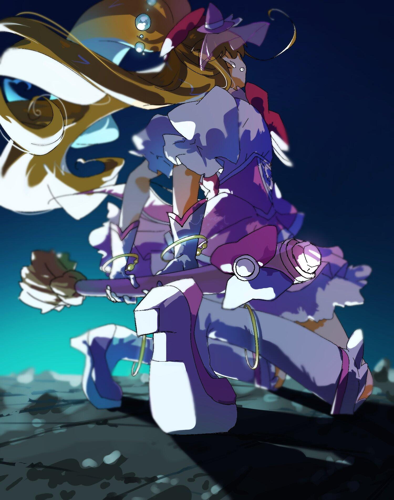

# 季度印象最深刻单集 2025.07

> 本文首发于个人博客\
> 发表日期：2025.10.12\
> 最后编辑于：{docsify-last-updated}

## 印象深刻 OP / ED 选

### 「水属性の魔法使い」 OP

<iframe style="aspect-ratio: 16/9;" src="https://www.youtube.com/embed/wxdHpj7r6Rc?si=VE_uRX41CTBTMC01" title="YouTube video player" frameborder="0" allow="accelerometer; autoplay; clipboard-write; encrypted-media; gyroscope; picture-in-picture; web-share" referrerpolicy="strict-origin-when-cross-origin" allowfullscreen></iframe>

## 「瑠璃の宝石」 #7 「渚のリサイクル工房」

> 播出时间：2025.08.17

作为这种类型的动画和上季度「mono」同样具备着异质的气息。本话聚焦于硝子，从小压抑的、小众的、不被理解的爱好，在纯粹的科研式的，不总是愉快轻松的研究之中闪烁。恰恰是本作从第一话开始不断暗示明示着的，爱好不总是轻松愉快的这一事实反而让本作更显真实和可贵，而这份可贵在从小坚持爱好的硝子因一次机缘巧好能让自己的爱好闪烁更显珍贵。所有同样拥有着某种热爱的人大概都能与此共鸣吧。
